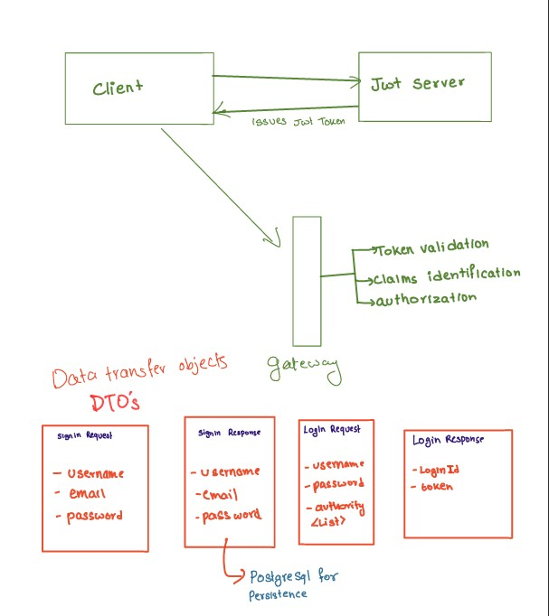
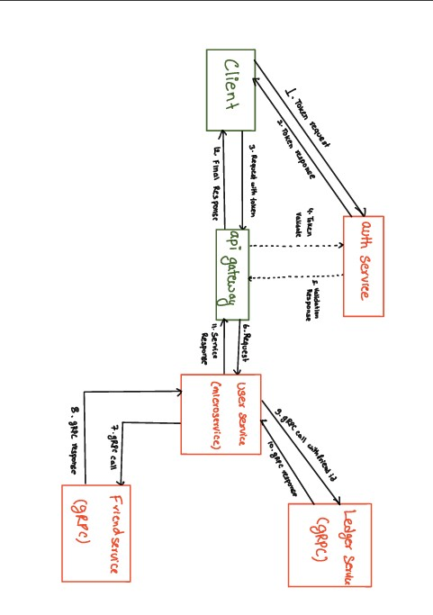

# 💰 Distributed Finance Management System (FMS)


A robust, microservices-based financial tracking application designed to manage personal loans and debts between friends. This project utilizes a **BFF (Backend for Frontend)** architecture, where this central Spring Boot Service orchestrates communication between clients and high-performance internal gRPC services.

## 🚀 Architecture Overview

The system is designed to be **stateless and distributed**. The core logic is split into domain-specific microservices:

* **Finance Gateway (This Service):** The entry point for all client requests. It handles HTTP REST traffic, performs validation, and delegates heavy lifting to backend services via **gRPC**.
* **User Service:** Manages user identity, profiles, and authentication data.
* **Friend Service (gRPC):** Handles the graph relationships (friendships) between users.
* **Ledger Service (gRPC):** The transactional core. Records debits/credits and calculates balances.




---

## 🛠️ Tech Stack

* **Framework:** Spring Boot 3.x
* **Communication:** REST API (External), gRPC (Internal)
* **Database:** PostgreSQL (Per-service isolation)
* **Containerization:** Docker & Docker Compose
* **Build Tool:** Maven

---

## 🔌 API Reference

All endpoints are prefixed with `/app`.

### 1. User Management
*Manages user profiles and identity.*

| Method | Endpoint | Description | Request Body / Params |
| :--- | :--- | :--- | :--- |
| `GET` | `/app` | Get all registered users | N/A |
| `POST` | `/app` | Register a new user | Body: `UserDto` |
| `GET` | `/app/{username}` | Get user details by username | Path: `username` |
| `PUT` | `/app/{id}` | Update user profile | Path: `id`, Body: `UserDto` |
| `DELETE` | `/app/{id}` | Delete a user account | Path: `id` |

### 2. Friendship Management
*Internal communication via `FriendshipServiceGrpcClient`.*

| Method | Endpoint | Description | Request Body / Params |
| :--- | :--- | :--- | :--- |
| `GET` | `/app/{userId}/friend` | Get a list of all friends for a user | Path: `userId` |
| `POST` | `/app/friend` | Add a new friend | Body: `FriendResponseDto` |
| `DELETE` | `/app/friend` | Remove a friendship | Body: `FriendResponseDto` |

### 3. Ledger & Transactions
*Internal communication via `LedgerServiceGrpcClient`.*

| Method | Endpoint | Description | Request Body / Params |
| :--- | :--- | :--- | :--- |
| `POST` | `/app/{uid}/ledger/{fid}` | **Create Transaction** (Lend/Borrow) | Path: `uid` (Giver), `fid` (Receiver)<br>Query: `?amount=100.50` |
| `PATCH` | `/app/ledger/{ledgerId}/status` | **Update Status** (Mark as Paid/Unpaid) | Query: `?paid=true` |
| `DELETE` | `/app/ledger/{ledgerId}` | Delete a transaction entry | Path: `ledgerId` |
| `GET` | `/app/ledger/receiver/{receiverId}` | Get history where user **received** money | Query: `giverId`, `page`, `size`, `sortBy` |
| `GET` | `/app/{giverId}/ledger/giver/` | Get history where user **gave** money | Query: `page`, `size`, `sortBy` |
| `GET` | `/app/{giverId}/ledger/giver/status` | Filter gave history by status (Paid/Pending) | Query: `status=true`, `page`, `size` |
| `GET` | `/app/ledger/{giverId}/date` | Filter history by specific date | Query: `receiverId`, `date=YYYY-MM-DD` |

---

## ⚙️ Configuration & Environment Variables

The application requires connection details for the internal gRPC services. Create a `.env` file or set these in your deployment environment variables:

```properties
# Server Configuration
SERVER_PORT=8080

# Database Configuration (For User Logic)
SPRING_DATASOURCE_URL=jdbc:postgresql://localhost:5432/user_db
SPRING_DATASOURCE_USERNAME=postgres
SPRING_DATASOURCE_PASSWORD=password

# gRPC Client Configuration (Target Services)
# These point to the internal Docker service names or localhost ports
GRPC_LEDGER_SERVICE_HOST=ledger-service
GRPC_LEDGER_SERVICE_PORT=50051

GRPC_FRIEND_SERVICE_HOST=friend-service
GRPC_FRIEND_SERVICE_PORT=50052

```
---
## 🐳 Running with Docker

This project is best run using the orchestration file included in the root directory

1. Build the project
```bash
  ./mvnw clean package -DskipTests
```
2. start the mesh
```bash
  docker-compose up --build -d
```
3. Verify Status: The API Gateway will be available at http://localhost:8080/app.
